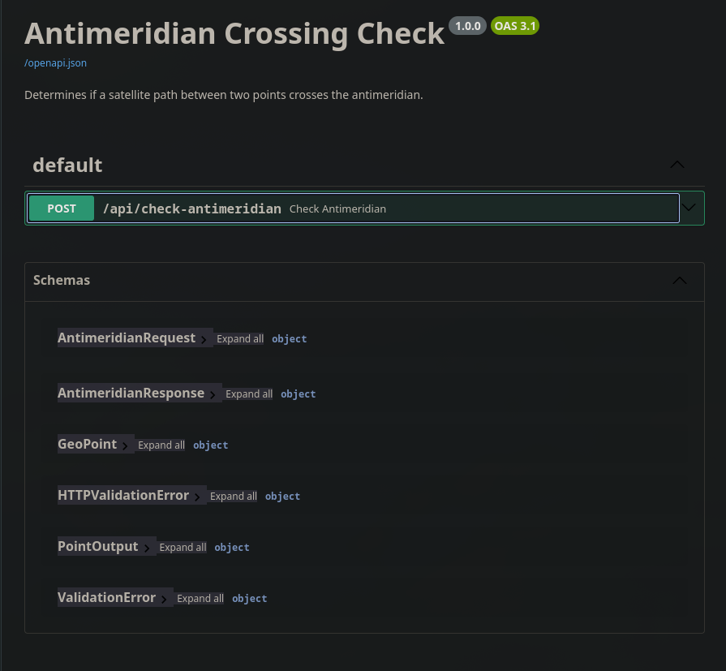

# Antimeridian Crossing Detector

API to determine if a satellite pass between two geographic points
crosses the antimeridian (International Date Line at +-180° longitude).

## Setup

```bash
uv sync
```

## Run

```bash
uv run uvicorn app.main:app --reload
```

Interactive API docs: http://localhost:8000/docs

## Test

```bash
uv run pytest tests/ -v
```

## Approach

A path crosses the antimeridian if the absolute longitude difference
between two points exceeds 180°. This handles the coordinate system
jump at +-180°.

**Example:**
- Point 1: 170.5° — Point 2: -175.3°
- Difference: |170.5 - (-175.3)| = 345.8° > 180° -> crosses

The mathematical logic is isolated in `app/logic.py` and independently
tested in `tests/test_logic.py`, separate from the API layer.

## API Documentation


## Limitations & Assumptions

- The crossing detection assumes a straight path between points.
  In reality, satellite paths follow orbital mechanics and may
  cross the antimeridian differently.

- Points exactly on the antimeridian (+-180°) are an edge case:
  180° and -180° are geographically identical, resulting in a
  longitude difference of 360° which triggers a crossing detection.

- The rule `diff > 180` treats 180° exactly as non-crossing.
  This is a deliberate choice based on the task specification.
